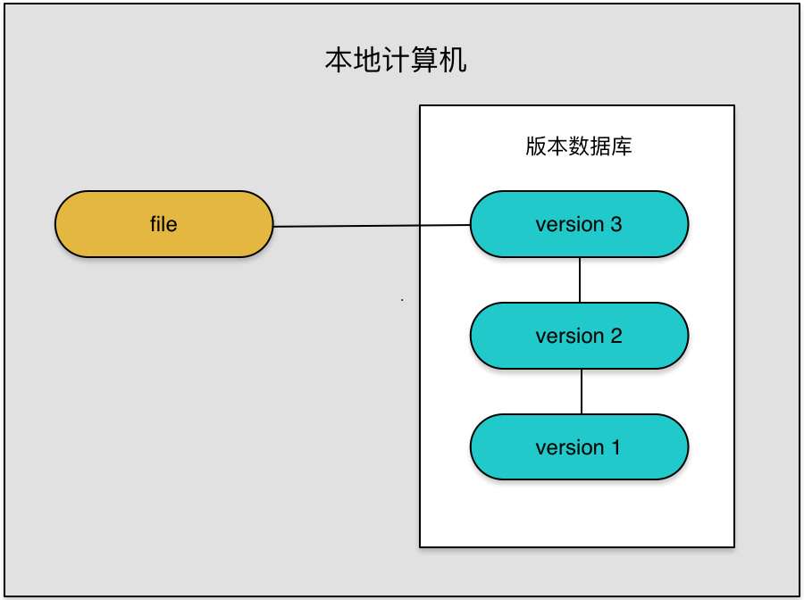
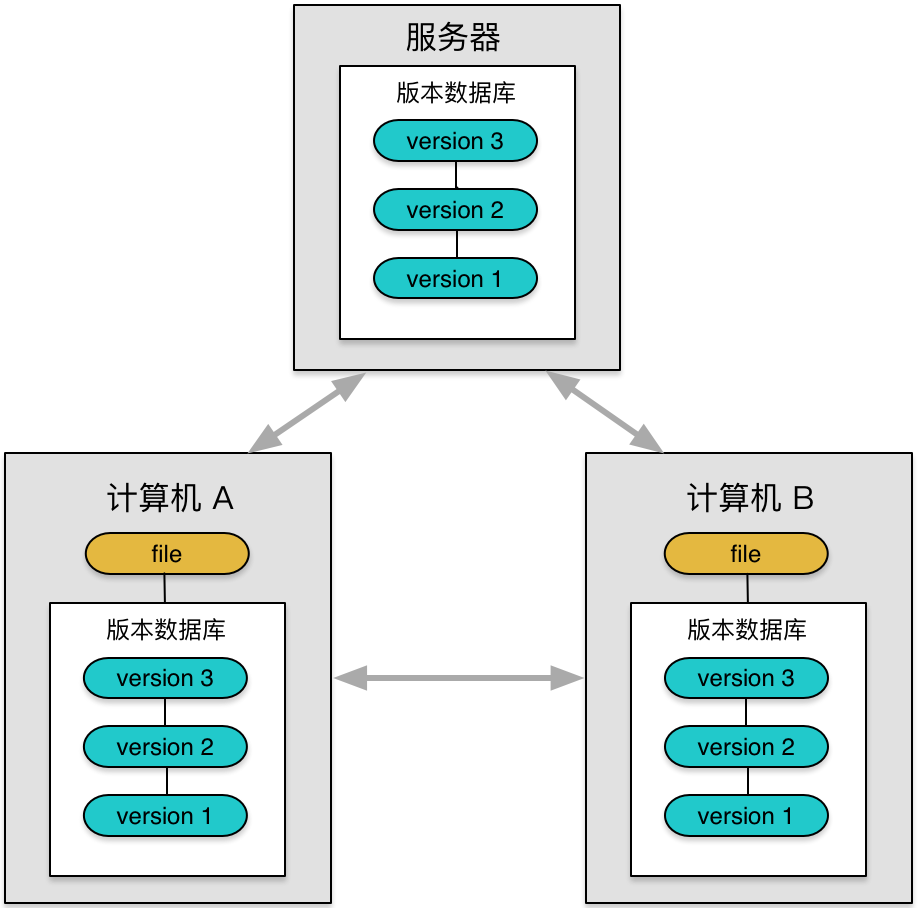
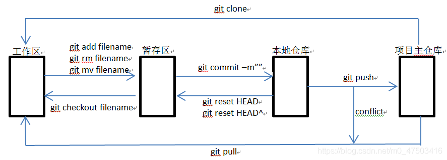

# **版本管理**

版本控制(Version control)，是维护工程蓝图的标准作法，能追踪工程蓝图从诞生一直到定案的过程。此外，版本控制也是一种软件工程技巧，借此能在软件开发的过程中，确保由不同人所编辑的同一程序文件都得到同步。

通过文档控制，能记录任何工程项目内各个模块的改动历程，并为每次改动编上序号。

一种简单的版本控制形式如下：赋给图的初版一个版本等级"A"。当做了第一次改变后，版本等级改为"B",以此类推。

版本控制能提供项目的设计者，将设计恢复到之前任一状态的选择权。

简言之，修改只要提交到版本控制系统，基本上都能找回，版本控制系统就像一台时光机器，可以让你回到任何一个时间点。

优点：
1. 记录文件所有的历史变化，这是版本控制系统的基本能力
2. 随时恢复到任意时间点，历史记录功能使我们不怕改错代码了
3. 支持多功能并行开发，通常版本控制系统都支持分支，保证了并行开发的可行
4. 多人协作并行开发，对于多人协作项目、支持多人协作开发的版本管理系统将事半功倍

## **分类**

版本控制系统根据类别可以分成：
1. 本地版本控制系统
2. 集中式版本控制系统
3. 分布式版本控制系统 

### **本地版本控制系统**

结构如下图所示：

优点：
1. 简单，很多系统中都有内置
2. 适合管理文本，如系统设置
缺点：
1. 其不支持远程操作，因此并不适合多人版本开发。

### **集中式版本控制系统**

结构如下图所示：

优点：
1. 适合多人团队协作开发
2. 代码集中化管理
缺点：
1. 单点故障
2. 必须联网，无法单机工作
代表工具有==SVN==、==CVS==

#### **SVN**

==TortoiseSVN==是一款非常易于使用的跨平台的版本控制/源代码控制软件

#### **CVS**

==CVS==是版本控制系统，是源配置管理(SCM)的重要组成部分。使用它，您可以记录源文件和文档的历史记录。
老牌的版本控制系统，它是基于客户端/服务器的行为使其可以容纳多用户，构成网络也很方便。
这一特性使得==CVS==成为位于不同地点的人同时处理数据文件(特别是程序的源代码)时的首选。

### **分布式版本控制系统**

结构如下图所示：

优点：
1. 适合多人团队协作开发
2. 代码集中化管理
缺点：
1. 可以离线工作
2. 每个计算机都是一个完整仓库
分布式版本管理系统每个计算机都有一个完整仓库，可本地提交，可做到离线工作，则不用像集中版本管理那样因为断网情况而无法工作
代表工具为==Git==、==HG==

#### **Git**

==Git==是目前世界上最先进的分布式版本控制系统，旨在快速高效地处理从小型到大型项目的所以事务特性：易于学习、占用内存小，具有闪电般快速的性能。
使用==Git==和==Gitlab==搭建版本控制环境是现在互联网公司最流行的版本控制方式

#### **HG**

==TortoiseHg==是一个免费的分布式源代码管理工具。它可以有效地处理任何规模的项目，并提供简单直观的界面。
==MercurialHg==是一种轻量级分布式版本控制系统，采用==Python==语言实现，易于学习和使用，扩展性强。

## **Git**

==git==是一个分布式版本控制软件，最初是为了更好地管理==Linux==内核开发而设计
分布式版本控制系统的客户端并不只是提取最新版本的文件快照，而是把代码仓库完整地镜像下来。这么一来，任何一处协调工作用的服务器发生故障、事后都可以用任何一个镜像出来的本地仓库恢复


项目开始，只有一个原始版仓库，别的机器可以==clone==这个原始版本库，那么所有的==clone==的机器，他们的版本库其实都是一样的，并没有主次之分。

所以在实现团队协作的时候，只要有一台电脑充当服务器的角色，其他每个人都从这个”服务器“仓库==clone==一份到自己的电脑上，并且各自把各自的提交推送到服务器仓库里，也从服务器仓库中拉取别人的提交。

==github==实际就可以充当这个服务器角色，其是一个开源协作社区，提供==Git==仓库托管服务，既可以让别人参与你的开源项目，也可以参与别人的开源项目。

### **工作原理**

当我们通过==git init==创建或者==git clone==一个项目的时候，项目目录会隐藏一个==.git==子目录，其作用是用来跟踪管理版本的

==Git==中所有数据在存储前都计算校验和，然后以校验和来引用，所以在我们修改或者删除文件的时候，==Git==能够知道
==Git==用以计算校验和的机制叫做 SHA-1 散列(hash，哈希)。这是一个由40个十六进制字符(0-9和a-f)组成字符串，基于 Git 中文件的内容或目录结构计算出来，如下：
```
24b9da6552252987aa493b52f8696cd6d3b00373
```
当我们修改文件的时候，==git==就会修改文件的状态，可以通过==git status==进行查询，状态情况如下：
1. 已修改(modified)：表示修改了文件，但还没保存到数据库中。
2. 已暂存(staged)：表示对一个已修改文件的当前版本做了标记，使之包含在下次提交的快照中。
3. 已提交(committed)：表示数据已经安全的保存在本地数据库中。
文件状态对应的，不同状态的文件在==Git==中处于不同的工作区域，主要分成了四个部分：
1. 工作区：相当于本地写代码的区域，如==git clone==一个项目到本地，相当于本地克隆了远程仓库项目的一个副本
2. 暂存区：暂存区是一个文件，保存了下次将提交的文件列表信息，一般在==Git==仓库目录中
3. 本地仓库：提交更新，找到暂存区域的文件，将快照永久性存储到Git本地仓库



### **命令**
==git==常用的命令
1. add：提交全部文件修改到缓存区
2. commit：
3. push
4. pull
5. clone
6. checkout

#### 配置命令

==Git==自带一个==git config==的工具来帮助设置控制==Git==外观和行为的配置变量，在我们安装完==git==之后，第一件事就是设置你的用户名和邮件地址。

后续每一个提交都会使用这些信息。他们会写入你的每一次提交中，不可更改。

设置提交代码的用户信息命令如下：
1. git config [--global] user.name "[name]"
2. git config [--global] user.email "[email address]"

#### 启动命令

一个==git==项目的初始有两个途径，分别是：
1. git init [project-name]：创建或在当前目录初始化一个git代码库
2. git init url：下载一个项目和他的整个代码历史

#### 日常基本操作

1. git init：初始化仓库，默认为==master==分支
2. add：提交全部文件修改到缓存区
3. add <具体文件路径+全名>：提交某些文件到缓冲区
4. git diff：查看当前代码==add==后，会==add==哪些内容
5. git diff --staged：查看现在==commit==提交后，会提交哪些内容
6. git status：查看当前分支状态
7. git pull <远程仓库名> <远程分支名>：拉取远程仓库的分支与本地当前分支
8. git pull <远程仓库名> <远程分支名> <本地分支名>：拉取远程仓库的分支与本地的某个分支合并
9. git commit --amend [file1] [file2]：重做上一次==commit==，并包括指定文件的新变化
10. git commit -v:提交时显示所有的diff信息
11. git commit -m [message]：提交代码到本地仓库，并写提交信息[message]

关于提交信息的格式，可以遵循以下的规则：
1. feat：新特性，添加功能
2. fix：修改bug
3. refactor：代码重构
4. docs：文档修改
5. style：代码格式修改
6. test：测试用例修改
7. chore：其他修改，比如构建流程，依赖管理

#### 分支操作
1. git branch：查看本地所有分支
2. git branch -r：查看远程所有的分支
3. git branch -a：查看本地和远程所有的分支
4. git merge <分支名>：合并分支
5. git merge --abort：合并分支出现冲突时，取消合并，一切回到合并前的状态
6. git branch <新分支名>：基于当前分支，新建一个分支
7. git checkout --orphan <新分支名>：新建一个空分支，会保留之前分支的所有文件
8. git branch -D <分支名>：删除本地某个分支
9. git push <远程库名>:<分支名>：删除某个远程分支
10. git branch <新分支名><提交ID>：从提交历史恢复某个删除掉的某个分支
11. git branch -m <原分支名> <新分支名>：分支更名
12. git checkout <分支名>：切换到本地某个分支
13. git checkout <远程库名>/<分支名>：切换到线上某个分支
14. git checkout -b <新分支名>：基于当前分支新建分支，并切换为这个分支


