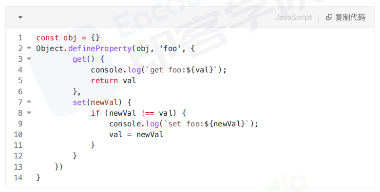
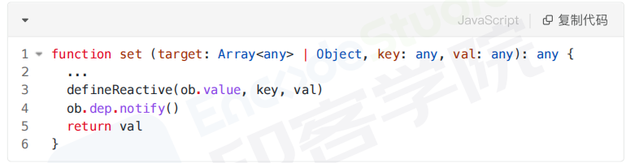
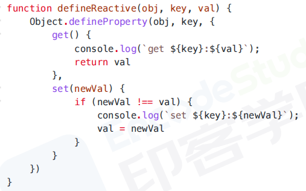

# 动态添加属性的问题
通过函数运行时的为组件添加属性，页面不会触发更新
## 原理
vue2使用object.defineProperty实现的数据响应式，由此可见对定义时存在的属性都进行这样的操作

新增的属性自然不具备响应式
## 解决
若想实现数据与视图更新
Vue.set()向一个响应式对象中添加一个property，并确保这个新的property同样是响应式的
defineReactive新增属性的响应式


Object.assign()
创建一个新的对象，合并原对象和混入对象的属性
```js
this.someObject=Object.assign({},this.someObject,{newProperty1:1})
```
*$forceUpdated()*
当需要做强制更新，九成的情况是，在某个地方写错了迫使Vue实例重新渲染，只影响实例本身和使用插槽的子组件。