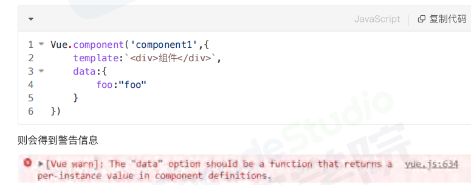
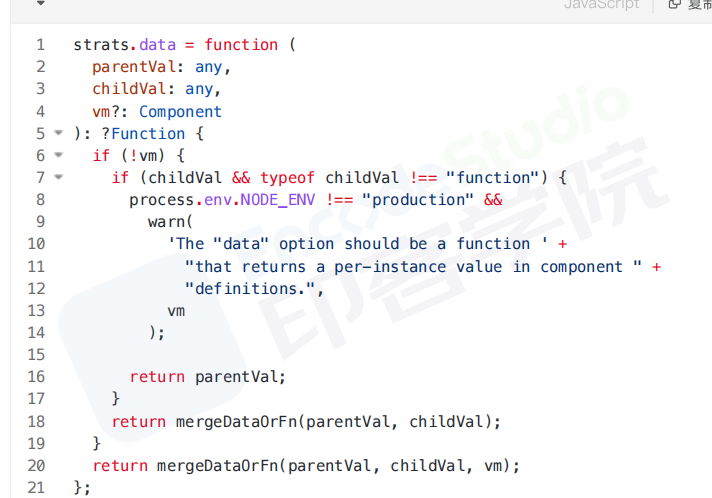

# data属性为何是一个函数

在实例中可以定义为对象或函数

如果是为组件只能是一个函数

## 区别
定义好组件时，vue最终都会通过vue.extend()构建组件实例
如果采用对象的data，每个组件的实例都会共用一个内存地址
采用函数返回一个全新的data形式

## 原理

data初始化时，对象或函数都可以

组件创建时进行选项合并，vm实例为undefined，进入if判断
如果类型不是函数，则发出警告

