# diff算法
一种通过同层的树节点进行比较的高效算法
1. 比较只会再同层级进行,不会跨层级比较
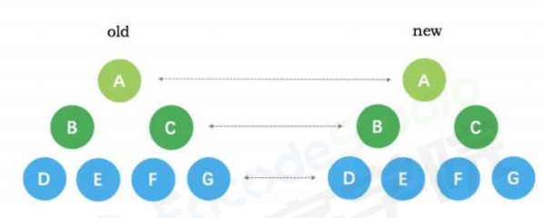
2. 在diff比较的过程中,循环从两边向中间收拢
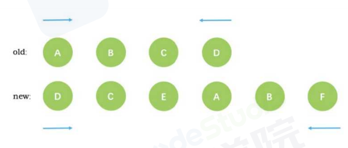
例子
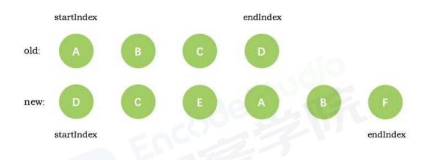
第一次循环结束后,发现新旧节点D相同,diff后将他作为第一个真实节点,同时endindex移动到c.
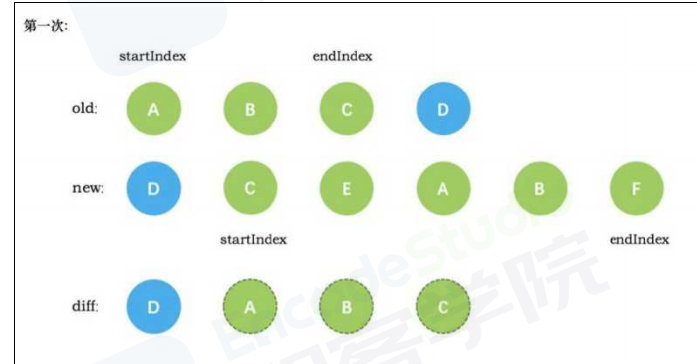
第二次循环后,新旧节点c相同,diff后建立c的真实节点,startindex移动到e,endindex移动到b

第三次循环,没有发现e,直接创建新的真实节点E,startindex移动到a
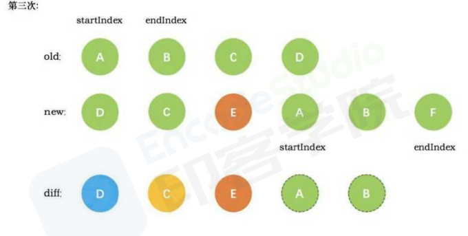
第四次循环,diff创建了a的真实节点,startindex移动到b
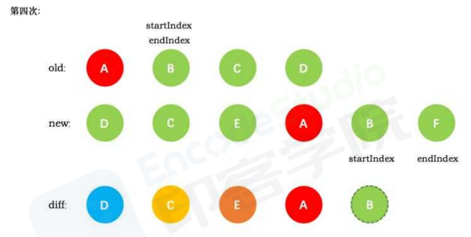
第五次循环,创建b的真实节点,startindex已经大于endindex,需要创建newStrtIdx和newEndIdx之间的所有节点,即F
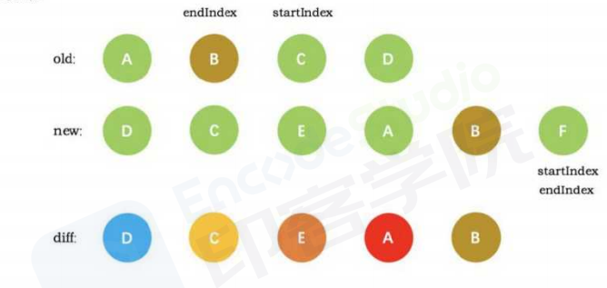
startindex已经大于endindex,退出循环,创建newStrtIdx和newEndIdx之间的所有节点,即F
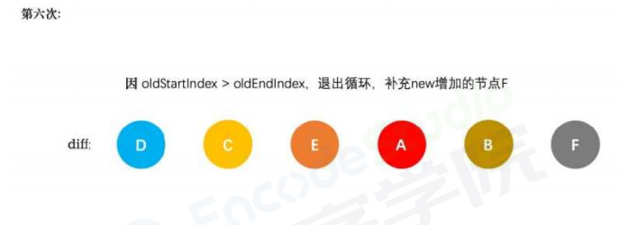

## 原理

当数据发生改变时,set方法会调用Dep.notify通知所有的订阅者Watcher,订阅者就会调用pacth给真实DOM打补丁,更新相应的视图
1. patch方法接受参数,oldVnode和Vnode
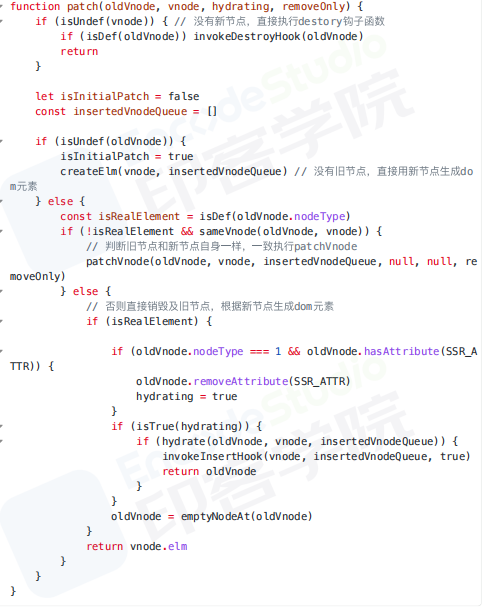
主要做了如下判断:
    没有新节点,直接触发旧节点的destory钩子
    没有旧节点,直接createElm新建节点
    新旧节点自身一样,通过sameVnode判断节点是否一样,一样时,直接调用patchVnode去处理这两个节点
    新旧节点自身不一样,直接创建新节点,删除旧的节点
2. patchVnode
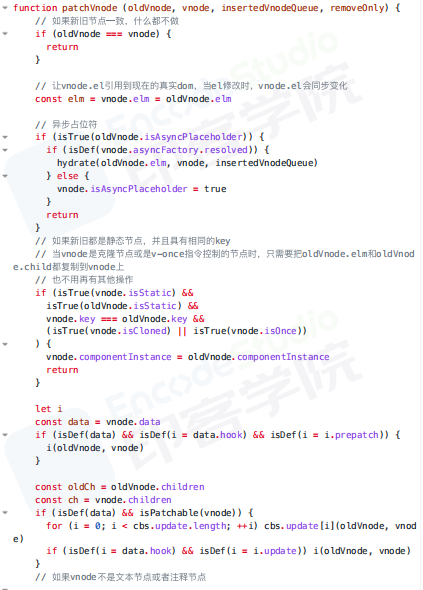
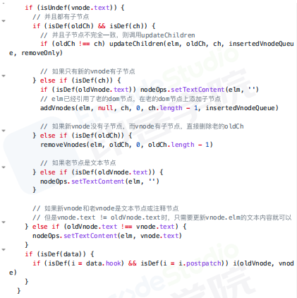
主要做了如下判断:
是否是文本节点,如果是,直接更新文本内容
如果存在子节点,则处理比较更新子节点
只有新节点有子节点,旧节点没有,所有的节点都是全新的,直接新建所有的新DOM,并且加入父节点
只有旧节点有子节点,把所有的旧节点删除,直接删除DOM
3. 子节点不完全一致,调用updateChildren
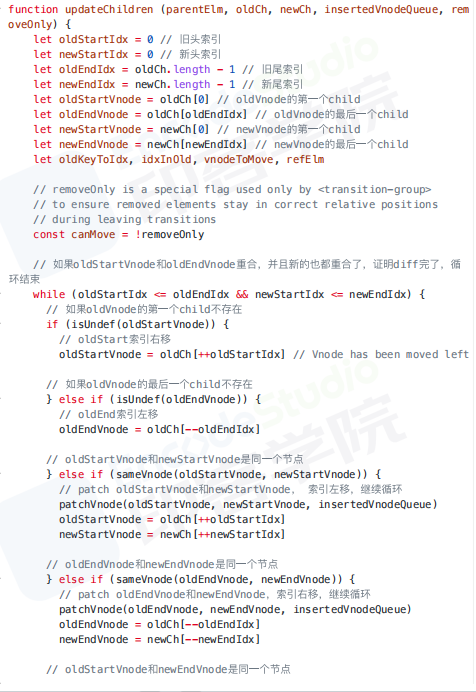
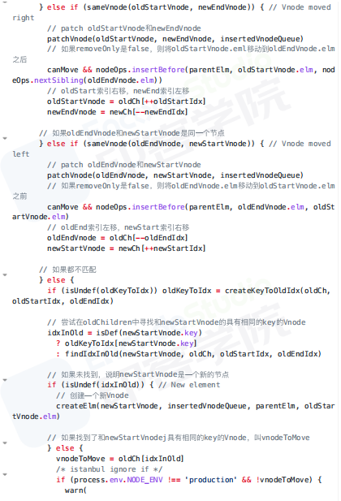
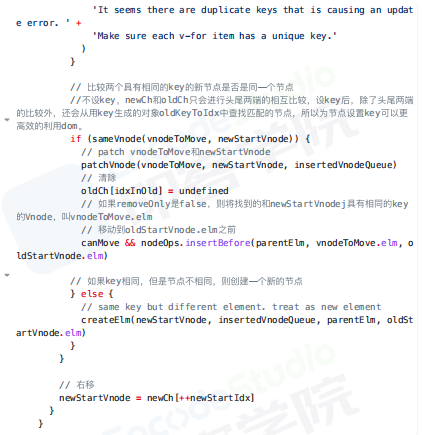
处理了五种情景:
    新老节点的start相同,直接patchVnode,新老节点的start索引+1
    新老节点的end相同,直接patchVnode,新老节点的end索引-1
    老节点的start和新节点的end相同时,patchVnode后,将当前真实DOM移动到oldEndVnode后面,老节点的start索引+1,新节点的end索引-1
    老节点的start和新节点的end相同时,patchVnode后,将当前真实DOM移动到oldEndVnode前面,老节点的end索引-1,新节点的start索引+1
    如果不满足以上四种情况,则没有节点可以复用，分为以下两种情况
        从旧的vnode为key值，对应的index序列为value值的哈希表中寻找到与newStartVnode一致key的旧的vnode节点，在进行patchVnode，同时将这个真实dom移动到oldstartVnode对应的真实dom的前面
        调用createElm创建一个新的dom节点放到newStartIdx的位置
## 总结
数据发生改变时，订阅者watcher就会调用patch给真实dom打补丁
通过isSameVnode进行判断，相同则调用patchVnode方法
patchVnode方法做了以下操作：
1. 找到对应的真实dom，称为el
2. 如果都有文本节点且不相等，将el文本节点设置为Vnode的文本节点
3. 如果oldVnode有子节点而Vnode没有，则删除el子节点
4. 如果oldVnode没有子节点而Vnode有，则将vnode的子节点真实化后添加到el
5. 如果两者都有子节点，则执行updateChildren函数比较子节点
updateChildren主要做了以下操作
1. 设置新旧Vnode的头尾指针
2. 新旧头尾指针进行比较，向循环中间靠拢，根据情况调用patchVnode进行patch重复流程、调用createElem创建一个新节点，从哈希表寻找key一致的Vnode节点再分情况操作