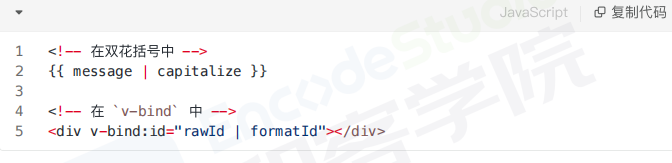
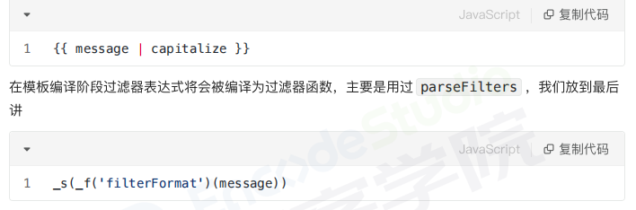

# 过滤器
自定义过滤器，用于一些常见的文本格式化（vue3中已废弃
他是管道式的

## 使用
双花括号插值，v-bind表达式

## 定义
在选项filters中定义，过滤器函数总接受表达式的值作为第一个参数

## 应用场景
单位转换，数字打点，文本格式化，时间格式化

## 原理
模板编译阶段过滤器表达式将会被编译为过滤器函数，

_f函数全名为resolveFilter，这个函数的作用是从this.$options.filters中找出注册的过滤器并返回

_s函数的全称是toString，过滤器处理后的结果会当作当前参数传递给toString函数，执行的结果保存到vnode中的text属性中
