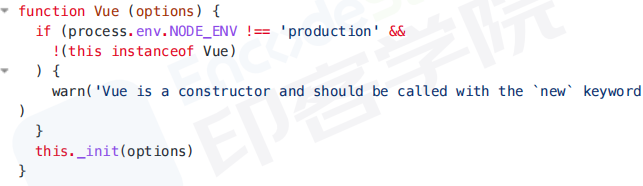
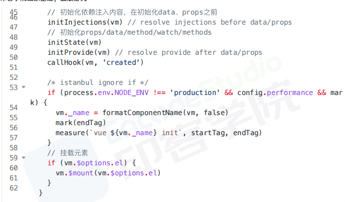
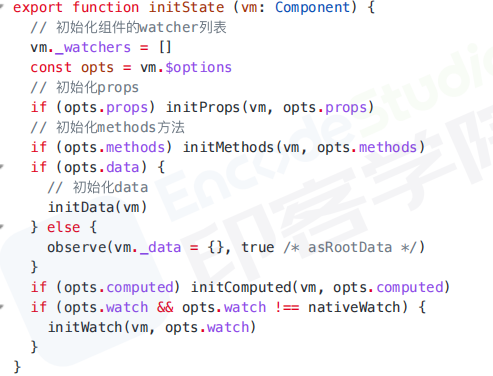
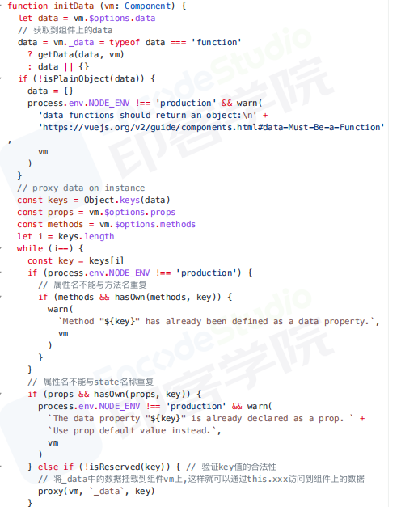
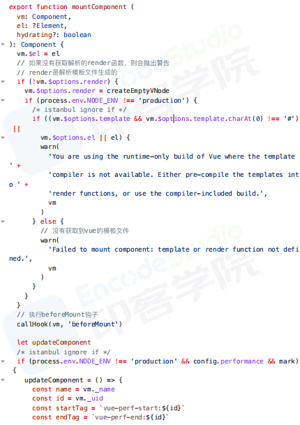
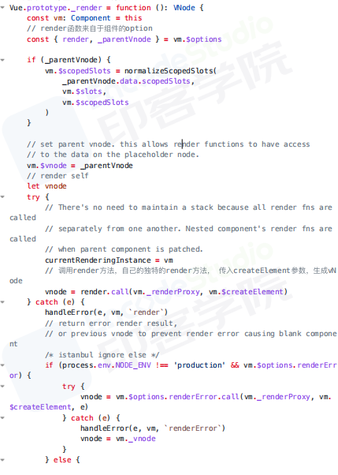
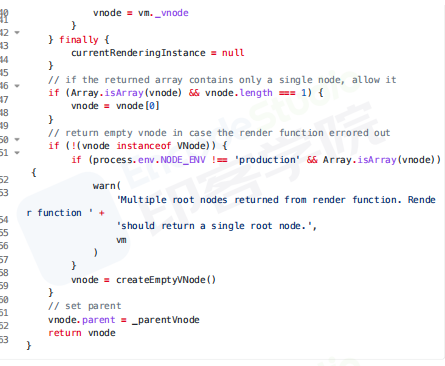

# 实例挂载过程

vue的构造函数,options是用户传递的配置项,调用*_init*方法

1. 关于_init方法

初始化生命周期,渲染方法,调用beforeCreate钩子,初始化依赖注入,initState,调用created钩子
使用vm.$mount方法挂载元素
2. initState方法完成props/data/method/watch/methods的初始化

3. initData方法

4. vm.$mount方法

如果没有提供render函数,则解析模板文件.
将html解析成ast树,转为render语法字符串,生成render方法
5. mountComponent渲染组件

触发beforeCreate钩子,定义updateComponent渲染页面视图的方法.监听组件数据,一旦发生变化,触发beforeCreate钩子.updateComponent主要执行初始化声明的render,update方法
6. render方法
render用于生成vnode

7. _update主要功能是调用patch,将vnode转为真实DOM,并更新到页面中

## 结论
1. new Vue调用_init方法
    1. 定义$set,$get,$delete,$watch等方法
    2. 定义$on,$off,$emit,$off等事件
    3. 定义_update,$forceUpdate,$destroy生命周期
2. 调用$mount方法进行页面的挂载
    1. 主要通过mountComponent方法
    2. 定义updateComponent更新函数
    3. _update将虚拟DOM生成真实DOM结构,并且渲染到页面中