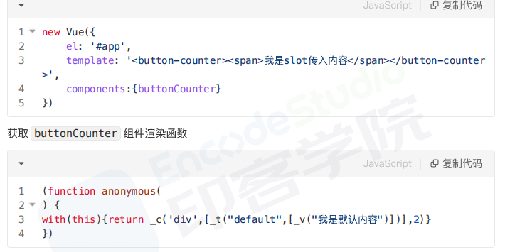

# slot
在HTML中slot元素，作为webComponents技术套件的一部分，是web组件内的一个占位符，该占位符可以在后期使用自己的标记语言填充

## 场景
通过slot插槽向组件内部指定位置传递内容，完成这个复用组件在不同场景的应用
比如布局组件、表格列、下拉选、弹框显示内容等。

## 分类
1. 默认插槽
2. 具名插槽
3. 作用域插槽
可获取子组件的信息

## 原理
slot本质上是返回vnode的函数，vue组件渲染到页面上需要经过templete=>render=>vnode=>dom过程

_v表示穿插普通文本节点，_t表示渲染插槽的函数

