# Vue2

## 组件通信

分类：
1. 父子组件之间
2. 兄弟组件之间
3. 祖孙与后代组件之间
4. 非关系组件间之间

8种常规方法

1. props传递：父传子
2. $emit触发自定义事件：子传父
3. ref:获取子组件数据，子传父
4. eventbus：兄弟组件之间传值
    1. emit触发事件，on监听事件
5. parent、root
    
5. attrs与listeners
    1. 向下传递属性，包含了未在props中声明的值
7. provide与inject
    1. 祖先定义provide
    2. 后代定义inject
8. vuex:存储共享变量的容器
    1. state：存放共享变量
    2. getter：增加一个getter的派生状态
    3. mutations：修改state的方法
    4. actions：异步的mutations

## data属性为何是一个函数

在实例中可以定义为对象或函数

如果是为组件只能是一个函数


### 区别
定义好组件时，vue最终都会通过vue.extend()构建组件实例
如果采用对象的data，每个组件的实例都会共用一个内存地址
采用函数返回一个全新的data形式

### 原理

data初始化时，对象或函数都可以

组件创建时进行选项合并，vm实例为undefined，进入if判断
如果类型不是函数，则发出警告


## 动态添加属性的问题
通过函数运行时的为组件添加属性，页面不会触发更新
### 原理
vue2使用object.defineProperty实现的数据响应式，由此可见对定义时存在的属性都进行这样的操作

新增的属性自然不具备响应式
### 解决
若想实现数据与视图更新
Vue.set()向一个响应式对象中添加一个property，并确保这个新的property同样是响应式的
defineReactive新增属性的响应式


Object.assign()
创建一个新的对象，合并原对象和混入对象的属性
```js
this.someObject=Object.assign({},this.someObject,{newProperty1:1})
```
*$forceUpdated()*
当需要做强制更新，九成的情况是，在某个地方写错了迫使Vue实例重新渲染，只影响实例本身和使用插槽的子组件。

## v-if和v-for的优先级

vue模板编译时，会将指令系统转为可执行的render函数，模板指令的代码都会生成在render函数中，通过app.$options.render就可以得到渲染函数

_l是vue的列表渲染函数，显然v-for优先级比v-if高

当置于不同的标签中


v-for比v-if先进行判断

### 注意
不同时使用使用在同一个标签上，如果条件出现在循环内部，可以用computed提前过滤那些不需要显示的项

## v-if和v-show
v-show隐藏是为元素添加css属性display：none，dom元素依然存在
v-if隐藏是将dom元素整个添加或删除
编译过程：v-if切换有一个局部编译/卸载的过程，切换过程中合适的销毁和重新组件内部的事件监听和子组件
编译条件：v-if是真正的条件渲染，确保在切换过程中条件块内的事件监听器和子组件适当地被销毁和重建。
v-if的状态更改，会触发组件的生命周期

### 原理
解析流程:
将模板template转为ast结构的JS对象
用ast得到的js对象拼装成render和staticRenderFns函数
render和staticRenderFns函数被调用后生成虚拟VNODE节点，该节点包含创建DOM节点所需信息
vm.patch函数通过虚拟DOM算法利用VNODE节点创建真实DOM节点

v-show原理

vShow函数，使用了生命周期函数，挂载之前，设置display属性
如果有transition就执行，否则直接设置display

v-if原理
返回一个node节点，render函数通过表达式的值来决定是否生成DOM


## key的作用
key是每一个vnode的唯一id，也是diff的一种优化策略，根据key更准确的找到对应的vnode节点

如果不使用key，vue就会使用就地复地原则：最小化element的移动，并且最大程度在同适当的地方对同类型的element，做patch或者reuse
如果使用key，根据keys的顺序记录element，曾经拥有key的element如果不再出现的话，会被直接remove或者destoryed
使用new Date()生成的时间戳作为key，手动强制触发重新渲染

对于以上，不使用key会依次比较，数据不同发生dom操作，c与f、d与c、e与d
如果使用key，vue只会更改顺序，将f插入到c之前

### 原理
判断是否为同一个key，如果没有设置key则为undefined

对新旧vnode进行diff，如何比对出的结果用来更新真实dom


## mixin
面向对象中的类，提供了方法的实现。其他的类可以访问mixin类的方法而不必成为子类
一个普通的js对象，包含组件中任意选项功能，将共有的功能以对象的方式传入mixins，
当组件使用mixins对象的选项是所有的mixins对象的选项都将被混入该组件本身的选项中来
局部混入

全局混入


### 注意
当组件存在与mixin对象相同的选项时，在递归合并的时候组件的选项会覆盖mixin的选项
如果相同选项为生命周期钩子，会合并为一个数组，先执行mixin的钩子

### 源码

1. 替换型：props，methods，computed
2. 合并型：data，通过set方法合并、重新赋值
3. 队列型：生命周期函数和watch
4. 叠加型：component、directives、filters

## 修饰符
五种修饰符：
1. 表单修饰符
    1. lazy：change事件之后进行同步
    2. trim：过滤首空格
    3. number：转为数值类型，内部调用parseFloat，如果无法解析，返回原来值
2. 事件修饰符：支持链式调用
    1. stop：阻止事件冒泡，event.stopPropagation方法
    2. prevent：阻止事件的默认行为，event.preventDefault方法
    3. self：当元素自身时触发处理函数
    4. once：绑定了事件以后只能触发一次
    5. capture：向下捕获事件，向下传递事件
    6. passive：相当于给onscroll事件整了一个.lazy修饰符
    7. native：让**组件**变得像内置标签那样监听根元素的原生事件，否则只会监听自定义事件
3. 鼠标按键修饰符
    1. left、right、middle
4. 键盘修饰符
5. v-bind修饰符
    1. async：双向绑定
    2. prop：自定义标签属性
    3. camel：将命名变为驼峰命名法

## nextTick

在下次DOM更新循环结束之后执行延迟回调。在修改数据之后立即使用这个方法，获取更新后的DOM.
数据变化后,vue将开启一个异步更新队列,视图需要等待队列中所有的数据变化完成后,再统一进行更新.

### 场景
*Vue.nextTick()*,第一个参数是回调函数,第二个参数为执行函数上下文.
返回一个promise对象,可以使用async和await完成相同作用的事情.

callbacks是异步操作队列,将回调函数压入
pending用于标识,同一时间只能执行一次
timerFunc()异步延迟函数,根据当前环境选择合适的方法

无论是宏任务还是微任务,都会放到flushCallbacks


## 实例挂载过程

vue的构造函数,options是用户传递的配置项,调用*_init*方法

1. 关于_init方法


初始化生命周期,渲染方法,调用beforeCreate钩子,初始化依赖注入,initState,调用created钩子
使用vm.$mount方法挂载元素
2. initState方法完成props/data/method/watch/methods的初始化

3. initData方法

4. vm.$mount方法


如果没有提供render函数,则解析模板文件.
将html解析成ast树,转为render语法字符串,生成render方法
5. mountComponent渲染组件


触发beforeCreate钩子,定义updateComponent渲染页面视图的方法.监听组件数据,一旦发生变化,触发beforeCreate钩子.updateComponent主要执行初始化声明的render,update方法
6. render方法
render用于生成vnode


7. _update主要功能是调用patch,将vnode转为真实DOM,并更新到页面中

### 结论
1. new Vue调用_init方法
    1. 定义$set,$get,$delete,$watch等方法
    2. 定义$on,$off,$emit,$off等事件
    3. 定义_update,$forceUpdate,$destroy生命周期
2. 调用$mount方法进行页面的挂载
    1. 主要通过mountComponent方法
    2. 定义updateComponent更新函数
    3. _update将虚拟DOM生成真实DOM结构,并且渲染到页面中

## diff算法
一种通过同层的树节点进行比较的高效算法
1. 比较只会再同层级进行,不会跨层级比较

2. 在diff比较的过程中,循环从两边向中间收拢
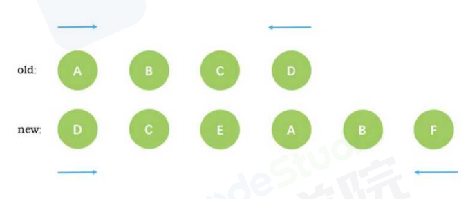
例子
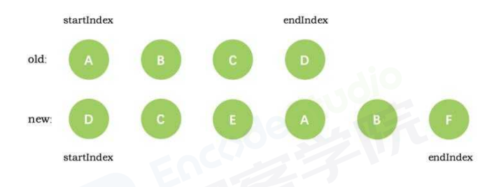
第一次循环结束后,发现新旧节点D相同,diff后将他作为第一个真实节点,同时endindex移动到c.
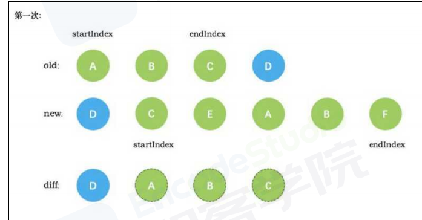
第二次循环后,新旧节点c相同,diff后建立c的真实节点,startindex移动到e,endindex移动到b

第三次循环,没有发现e,直接创建新的真实节点E,startindex移动到a

第四次循环,diff创建了a的真实节点,startindex移动到b
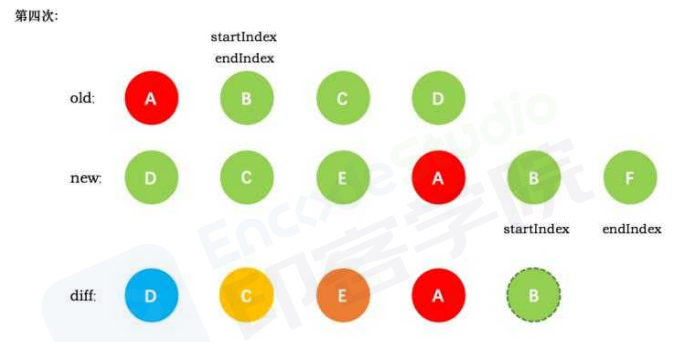
第五次循环,创建b的真实节点,startindex已经大于endindex,需要创建newStrtIdx和newEndIdx之间的所有节点,即F
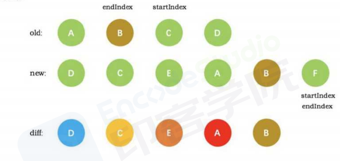
startindex已经大于endindex,退出循环,创建newStrtIdx和newEndIdx之间的所有节点,即F
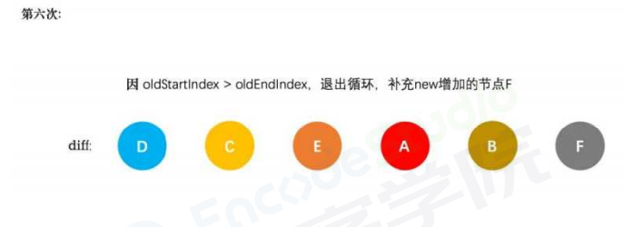

### 原理

当数据发生改变时,set方法会调用Dep.notify通知所有的订阅者Watcher,订阅者就会调用pacth给真实DOM打补丁,更新相应的视图
1. patch方法接受参数,oldVnode和Vnode

主要做了如下判断:
    没有新节点,直接触发旧节点的destory钩子
    没有旧节点,直接createElm新建节点
    新旧节点自身一样,通过sameVnode判断节点是否一样,一样时,直接调用patchVnode去处理这两个节点
    新旧节点自身不一样,直接创建新节点,删除旧的节点
2. patchVnode
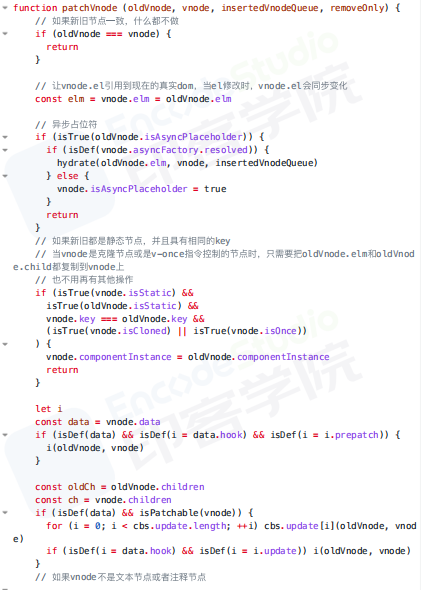
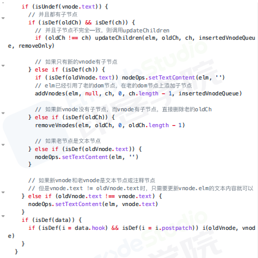
主要做了如下判断:
是否是文本节点,如果是,直接更新文本内容
如果存在子节点,则处理比较更新子节点
只有新节点有子节点,旧节点没有,所有的节点都是全新的,直接新建所有的新DOM,并且加入父节点
只有旧节点有子节点,把所有的旧节点删除,直接删除DOM
3. 子节点不完全一致,调用updateChildren

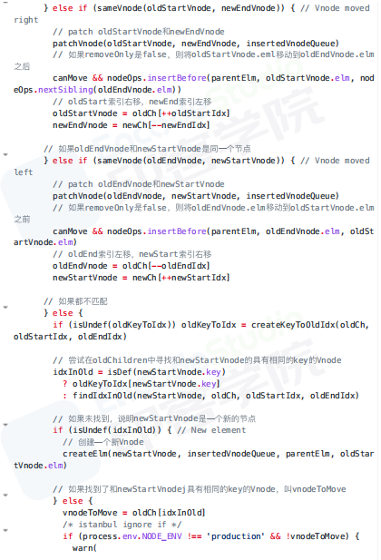

处理了五种情景:
    新老节点的start相同,直接patchVnode,新老节点的start索引+1
    新老节点的end相同,直接patchVnode,新老节点的end索引-1
    老节点的start和新节点的end相同时,patchVnode后,将当前真实DOM移动到oldEndVnode后面,老节点的start索引+1,新节点的end索引-1
    老节点的start和新节点的end相同时,patchVnode后,将当前真实DOM移动到oldEndVnode前面,老节点的end索引-1,新节点的start索引+1
    如果不满足以上四种情况,则没有节点可以复用，分为以下两种情况
        从旧的vnode为key值，对应的index序列为value值的哈希表中寻找到与newStartVnode一致key的旧的vnode节点，在进行patchVnode，同时将这个真实dom移动到oldstartVnode对应的真实dom的前面
        调用createElm创建一个新的dom节点放到newStartIdx的位置
### 总结
数据发生改变时，订阅者watcher就会调用patch给真实dom打补丁
通过isSameVnode进行判断，相同则调用patchVnode方法
patchVnode方法做了以下操作：
1. 找到对应的真实dom，称为el
2. 如果都有文本节点且不相等，将el文本节点设置为Vnode的文本节点
3. 如果oldVnode有子节点而Vnode没有，则删除el子节点
4. 如果oldVnode没有子节点而Vnode有，则将vnode的子节点真实化后添加到el
5. 如果两者都有子节点，则执行updateChildren函数比较子节点
updateChildren主要做了以下操作
1. 设置新旧Vnode的头尾指针
2. 新旧头尾指针进行比较，向循环中间靠拢，根据情况调用patchVnode进行patch重复流程、调用createElem创建一个新节点，从哈希表寻找key一致的Vnode节点再分情况操作

## 组件和插件的区别

组件是把图形、非图形的各种逻辑均抽象为一个统一的概念来实现的开发模式
优势：
1. 降低系统的耦合度，保持接口不变的情况下，替换不同的组件快速完成需求
2. 调试方便，出现问题时可以用排除法直接移除组件、快速定位问题
3. 提高可维护性，由于每个组件的职责单一，并且组件在系统中是被复用的，使用对代码进行优化可获得系统的整体升级

插件用来给Vue添加全局功能：
1. 添加全局方法或属性：vue-custom-element
2. 添加全局资源：指令、过滤器、过渡，vue-touch
3. 全局混入来添加一些组件选项：vue-router
4. 添加Vue实例方法，通过把他们添加到Vue.prototype上实现
5. 一个库，提供自己的api

### 区别
组件有vue单文件，插件暴露了一个install函数
组件注册有全局注册和局部注册，插件使用Vue.use进行注册

### 场景
组件是业务模块，插件是功能模块

## 跨域问题
跨域是浏览器基于同源策略的安全手段

同源有三个部分：
1. 协议相同
2. 主机相同
3. 端口相同

非同源请求，则发生了跨域

### 方法
1. jsonp
2. cors
跨域资源共享，一系列的HTTP头组成，决定了是否阻止前端代码获取跨域请求的响应
2. proxy
代理，网络代理，允许一个通过这个服务与另一个网络终端进行非直接的连接
vue.config.js文件配置，最终发布上线时如果web应用和接口服务器不在一起仍会跨域
通过服务端实现代理请求转发，express、nginx


## 自定义指令
在vue中提供了一套数据驱动视图更为方便的操作，称之为指令

### 实现
通过Vue.directive方法进行注册
第一个参数是指令的名字，第二个参数可以是对象数据，也可以是一个指令函数
自定义指令也存在钩子函数：
1. bind：只调用一次，指令第一次绑定到元素时调用
2. inserted：被绑定元素插入父节点时调用
3. update：所在组件的Vnode更新时调用，可能发生在其子Vnode更新之前。
4. componentUpdated：指令所在的组件Vnode及其子Vnode全部更新后调用
5. unbind：只调用一次，指令与元素解绑时调用
钩子函数的参数：
1. el：指令绑定的元素，可以操作dom
2. binding：包含余下属性的对象
    1. name
    2. value：绑定值
    3. oldValue：指令绑定的前一个值，只在update、componentUpdated可使用
    4. expression：字符串形式的指令表达式
    5. arg：传给指令的参数，可选
    6. modifiers：一个包含修饰符的对象
3. vnode：虚拟节点
4. oldVnode：上一个虚拟节点，只在update、componentUpdated可使用

### 场景
防止表单重复提交
图片懒加载
一键copy的功能

## 过滤器
自定义过滤器，用于一些常见的文本格式化（vue3中已废弃
他是管道式的

### 使用
双花括号插值，v-bind表达式
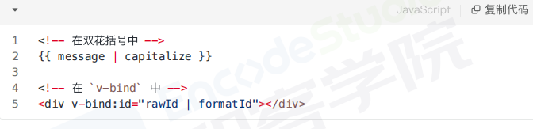

### 定义
在选项filters中定义，过滤器函数总接受表达式的值作为第一个参数

### 应用场景
单位转换，数字打点，文本格式化，时间格式化

### 原理
模板编译阶段过滤器表达式将会被编译为过滤器函数，
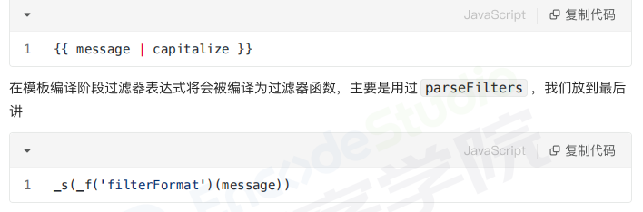

_f函数全名为resolveFilter，这个函数的作用是从this.$options.filters中找出注册的过滤器并返回

_s函数的全称是toString，过滤器处理后的结果会当作当前参数传递给toString函数，执行的结果保存到vnode中的text属性中

## slot
在HTML中slot元素，作为webComponents技术套件的一部分，是web组件内的一个占位符，该占位符可以在后期使用自己的标记语言填充


### 场景
通过slot插槽向组件内部指定位置传递内容，完成这个复用组件在不同场景的应用
比如布局组件、表格列、下拉选、弹框显示内容等。

### 分类
1. 默认插槽
2. 具名插槽
3. 作用域插槽
可获取子组件的信息

### 原理
slot本质上是返回vnode的函数，vue组件渲染到页面上需要经过templete=>render=>vnode=>dom过程


_v表示穿插普通文本节点，_t表示渲染插槽的函数

## 虚拟dom
虚拟DOM是对一层真实DOM的抽象，以js对象作为基础的树，用对象的属性来描述节点，最终可以通过一系列操作使这棵树映射到真实环境上。

在js对象中，虚拟DOM表现为一个Object对象。并且至少包含签名（tag）、属性（attrs）和子元素对象（children）

### 为什么需要
DOM是很慢的，页面的性能问题，大部分是由DOM操作引起的。
一次操作时，需要更新10个dom节点，浏览器会依次执行10次更新操作。
而通过vnode，同样的更新10个dom节点，虚拟dom不会立即操作dom，而是将这10次更新内容保存在本地的一个js对象中，最终将这个js对象一次性attach到dom树上，避免大量的无谓计算。


## 错误处理
主要的错误来源包括：
1. 后端接口错误
2. 代码中本身逻辑错误
设置全局错误处理函数
生命周期钩子


## vue权限管理
权限控制，确保用户只能访问到被分配的资源
前端权限归根结底是请求的发起权，页面加载触发、按钮点击触发

可以分为四个方面：
1. 接口权限
jwt验证
2. 按钮权限
    1. v-if
    2. 自定义指令
3. 菜单权限
    1. 菜单与路由分离，菜单由后端返回，缺点：菜单与路由做一一对应，全局路由守卫里，每次路由跳转都要做判断
    2. 菜单和路由都有后端返回，缺点：全局路由守卫里，每次路由跳转都要做判断；前后端配合要求更高
4. 路由权限
    1. 在路由上标记相应的权限信息，每次路由跳转前做校验
    2. 四种缺点：
        1. 如果路由很多，对性能会有影响
        2. 全局路由守卫里，每次路由跳转都要做权限判断
        3. 菜单信息写死在前端，要改个文字或权限信息，都需要重新编译
        4. 菜单和路由耦合在一起，定义路由的时候还有添加菜单显示标题，图表之类的信息，而且路由不一定作为菜单显示，还需要更多的字段进行标识
    3. 初始化，先挂在不需要权限控制的路由，用户登陆后，获取用户的权限信息，筛选出有权限的路由，在全局路由守卫中调用addRoutes添加路由
    4. 缺点：
        1. 全局守卫里，每次路由跳转都要做判断
        2. 菜单信息写死在前端，要改个文字或权限信息，都需要重新编译
        3. 菜单和路由耦合在一起，定义路由的时候还有添加菜单显示标题，图表之类的信息，而且路由不一定作为菜单显示，还需要更多的的字段进行标识


## keep-alive
能在组件切换过程中将状态保留在内存中，防止重复渲染dom
可以设置以下props属性：
1. include
2. exclude
3. max
设置了缓存的组件会多出来两个生命周期钩子（activated、deactivated）

### 场景
首页-列表页-商详页-再返回，列表页应该缓存
首页-列表页-商详页-返回列表页（缓存-返回到首页（缓存-再次进入列表页（不缓存
利用路由元信息，在keep-alive判断是否需要缓存

### 获取缓存后组件的数据
1. 每次组件渲染时，都会执行beforeRouteEnter,next方法中可以拿到组件实例，vm.getData
2. 缓存的组件被激活时，都会执行actived钩子，可以从里面拿到


## SPA
SPA，单页应用SPA是一种网络应用程序或网站的模型，通过动态重写当前页面来与用户交互

和MPA多页应用的区别


## 部署到服务器后404
在history模式下的问题，但在hash模式下没有问题
history的路由切换会被当成http请求
配置将任何页面重定向到index.html，把路由交给前端处理


## vue3
速度更快、体积减少、更易维护、更接近原生、更易于使用

比较：
1. 重写了虚拟dom实现
2. 编译模板优化
3. 更高效的组件初始化
4. undate性能提高
5. SSR速度提高2~3倍

### 新特性
1. framents
支持多个根节点
2. teleport
传送，在逻辑位置写模板代码，然后再vue范围之外渲染他
它可以出现在任何地方
3. 组合式api
}8Z8651L7C8.png>)
4. createRenderer
自定义渲染器，将vue的开发模型扩展到其他平台

### vue3优化

1. diff算法优化：
对会发生变化的地方增加了flag标记，变化时直接找到该地方进行比较
2. 静态提升：
对不参与更新的元素，会做静态提升，只会被创建一次，渲染时直接复用
3. 事件监听缓存：
默认情况下绑定事件行为会被视为动态绑定，所以每次都会追踪他的变化
4. SSR优化：
当静态内容大到一定量级时候，会用createStaticVNode方法在客户端去生成一个static node，这些静态node，会被直接innerHtml，就不需要创建对象，然后根据对象渲染
5. 源码体积
移除了一些不常用的API，使用了TreeShanking，不使用的内容都会被摇掉

### 响应式系统
vue2使用defineProperty来劫持整个对象，深度遍历为每个属性添加getter和setter实现响应式
vue3采用proxy重写了响应式系统，proxy可以对整个对象进行监听，不需要深度遍历
1. 监听动态属性的添加
2. 监听数组的索引和length属性
3. 监听删除属性

defineproperty和proxy实现的区别：
原理，数据更新后，通知相关的依赖函数
defineproperty无法劫持到对象的删除和添加属性的操作，动态的属性不具备响应式，深层的监听也造成了性能的极大问题
proxy劫持整个对象的基本操作，而不是某个属性，多达13种拦截方法


