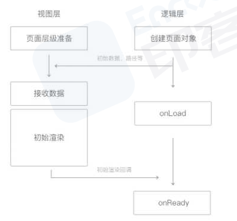

# 小程序

相比h5，小程序与其的区别有如下：
1. 运行环境：基于浏览器内核重构的内置解析器
2. 系统权限：获得更多的系统权限，如网络通讯状态、数据缓存能力
3. 渲染机制：逻辑层和渲染层分开

## 生命周期
1. 应用的生命周期
|生命周期|说明|
|---|---|
|onLaunch|初始化完成时触发，全局只触发一次|
|onShow|启动，或从后台进入前台显示时触发|
|onHide|从前台进入后台时触发|
|onError|发生脚本错误或API调用报错时触发|
|onPageNotFound|打开的页面不存在时触发|
|onUnhandleRejection|未处理的Promise拒绝时触发|
|onThemeChange|系统切换主题时触发|
2. 页面的生命周期
|生命周期|值|作用|
|---|---|---|
|onLoad|监听页面加载|发送请求获取数据|
|onShow|监听页面显示|请求数据|
|onReady|页面初次渲染完成|获取页面元素|
|onHdie|页面隐藏|终止任务，如定时器或播放音乐|
|onUnload|页面卸载|终止任务|
3. 组件的生命周期
|生命周期|说明|
|---|---|
|created|组件创建完成|
|attached|进入页面节点树|
|ready|在渲染线程被初始化已经完成|
|moved|在组件实例被移动到节点树另一个位置时执行|
|detached|在组件实例被从页面节点树移除时执行|
|error|组件方法抛出错误|
4. 组件所在页面的生命周期
|生命周期|说明|
|---|---|
|show|组件所在的页面被展示时执行|
|hide|组件所在的页面被隐藏时执行|

### 执行过程
应用生命周期
1. 打开小程序，触发onLaunch
2. 初始化完成后，触发onShow
3. 前台进入后台，触发onHide
4. 后台进入前台，触发onShow
5. 后台运行一定时间，或系统资源占用高，会被销毁

页面生命周期
1. 小程序注册完成后，加载页面，触发onLoad
2. 页面载入后触发onShow，显示页面
3. 首次显示页面，会触发onReady方法，渲染页面元素和样式，一个页面只会调用一次
4. 后台运行或跳转到其他页面时，触发onHdie
5. 后台进入前台或重新进入页面时，触发onShow
6. 重定向方法wx.redirectTo()或关闭当前页面返回上一页wx.navigationBack()，触发onUnload

执行顺序如下：
1. 打开小程序：(app)onLaunch=>(app)onShow=>(pages)onLoad=>(pages)onShow=>(pages)onReady
2. 进入下一个页面：(pages)onHdie=>(next)onLoad=>(next)onShow=>(next)onReady
3. 返回上一个页面：(curr)onLaunch=>(pre)onShow
4. 离开小程序：(app)onHdie
5. 再次进入：小程序未销毁=>(app)onShow(执行以上的顺序),小程序销毁，(app)onLaunch重新开始执行

## 登录流程
在小程序中，通过微信提供的登录能力，可以轻松的获取微信提供的用户身份标识，快速简历小程序内的用户体系，从而实现登录功能。
涉及到openid和code的概念：
1. wx.login()方法生成code，将code作为参数传递为微信服务器指定接口，就可以获取用户的openid
2. 对于每个小程序，微信都会将用户的微信ID映射出一个小程序openid，作为用户在这个小程序的唯一标识

1. 通过wx.login()获取到用户的code判断用户是否授权读取用户信息，调用wx.getUserInfo读取用户数据
2. 由于小程序后台授权域名无法授权微信的域名，需要自身后端调用微信服务器获取用户信息
3. wx.request()方法请求开发者服务器，后端把appid、appsecret、code一起发送到微信服务器。
4. 微信服务器返回openid、以及本次会话密钥session_key
5. 后端从数据库中查找openid，如果没有查到记录，说明该用户没有注册
6. session_key是对用户数据加密签名的密钥。
7. 生成session并返回给小程序
8. 小程序将session存到storage里面
9. 下次请求时，先从storage里面读取，然后带给服务端
10. 服务端比对session对应的记录，然后校验有效期

### 检验登录状态是否过期
1. 通常做法是在登陆状态中保存有效期数据，该数据应该在服务端校验登陆状态和约定时间做对比
这种做法需要将本地的登陆状态发送到服务端，服务端判断无效登陆状态时再返回需重新执行登录过程的消息给小程序
2. 调用wx.checkSession检验微信登陆状态是否过期
如果过期，发起完整的登录流程
不过期，继续使用本地保存的自定义登陆状态

## 路由跳转
微信小程序拥有web和application共同的特征，每个页面可以看成一个pageModel，pageModel全部以栈的形式进行管理

### 跳转方式
1. wx.navigateTo(Object)
缓存当前页面，跳转到应用内的某个页面，通过wx.navigateBack(Object)返回，页面之间通过hide、show切换
2. wx.redirectTo(Object)
微信的页面栈有10层，过多的页面会挤占微信分配给小程序的内存，该方法的跳转不会缓存页面，所以切换时页面需要重新加载。
3. wx.switchTab(Object)
针对tabr页面的跳转，会关闭其他的非tabar的页面
4. wx.navigateBack(Object)
关闭当前页面，返回上一级或多级页面，通过getCurrentPages()获取当前的页面栈
页面不断出栈，直到目标返回页
5. wx.reLaunch(Object)
关闭所有的页面，打开到某个页面，返回的时候跳转到首页

## 发布流程

1. 上传代码
2. 提交审核
3. 发布版本

## 支付流程
小程序为电商类小程序，提供了非常完善、优秀、安全的支付功能
在小程序中调用微信的API完成支付功能，方便，快捷

## 实现原理
网页开发中，渲染线程和脚本是互斥的，长时间的脚本运行会导致页面失去响应，js是单线程的
在小程序中，选择了Hybrid的渲染方式，将逻辑层和视图层分开，双线程同时运行，视图层使用webview进行渲染，逻辑层允许在jscore。
1. 渲染层：界面渲染相关的任务全都在webview线程里执行。一个小程序存在多个界面，所以渲染层存在多个webview线程
2. 逻辑层：jscore线程运行JS脚本，在这个环境下执行的都是有关小程序业务逻辑的代码

## 通信
小程序在渲染层，宿主环境会被wxml转为对应的JS对象
在逻辑层发生数据变更的时候，通过宿主环境提供的setData()方法把数据从逻辑层传递到渲染层，再经过对比前后差异，把差异应用在原来的DOM树上，渲染出正确的视图

当视图存在交互时，例如按钮触发，这类反馈应该通知给开发者的逻辑层，需要将对应的处理状态呈现给用户

对于事件的分发处理，微信进行了特殊的处理，将所有的事件拦截后，丢到逻辑层交给js处理

小程序是基于双线程的，在任何逻辑层和视图层之间的数据传递都是线程间的通信，会有一定的延时，因此在小程序中，页面更新是异步操作
异步会使运行时序变得复杂一些，如果渲染层工作较快完成，就到等待逻辑层的指令才能进行下一步工作。
因此逻辑层和渲染层之间需要有一定的机制保证时序正确，在每个小程序页面的生命周期中，存在着若干次页面数据通信。

### 运行机制
小程序启动运行有两种情况：
1. 冷启动：首次打开、主动销毁后再次打开的情况，此时小程序需要重新加载启动，即为冷启动
每次冷启动时，都会检查是否有更新版本，如果有，异步下载新版本的代码包，并同时用客户端本地的包进行启动，即新版本的小程序需要等下一次冷启动才会应用上。
2. 热启动：已经打开过小程序，在一段时间内再次打开，无需重新启动，只需要将后台的小程序切换到前台，这个过程就是热启动

## 优化手段
小程序首次启动前，微信会为小程序准备好通用的运行环境，如运行中线程和基础库的初始化
然后开始进入启动状态，展示一个固定的启动界面，包含小程序的图标、名称和加载提示图标。
1. 下载小程序代码包
经过编译、压缩、打包之后的代码包
2. 加载小程序代码包
3. 初始化小程序手段

### 加载
控制小程序包的大小：
1. 压缩代码
2. 清理无用的代码和资源文件
3. 减少资源包中的图片等资源的数量和大小，图片资源压缩率有限
并且可以采用分包加载的操作，将用户访问率高的页面放在主包内，将访问率低的页面放入子包内，按需加载
当用户点击到子包的目录时，还有一个代码包的下载过程，子包也不建议太大。或者使用子包预加载技术，并不需要等到用户点击到子包页面后再下载子包。

### 渲染
请求在onLoad就加载，尽量减少不必要的https请求，可u使用getStorageSync()及setStorageSycn()方法将数据存储在本地
可以在前置页面将一些有用的字段带到当前页，进行首次渲染(列表页的某些数据=>详情页)，没有数据的模块可以进行骨架屏的占位
提高页面的多次渲染效率主要在于正确使用setData：
1. 将多次的setData合并为一次setData
2. 数据通信的性能与数据量正相关，因而如果有一些数据字段不在界面中展示且数据结构比较复杂或包含长字符串，则不应使用setData来设置这些数据
3. 与界面渲染无关的数据最好不要设置在data中，可u考虑设置在page对象的其他字段下

